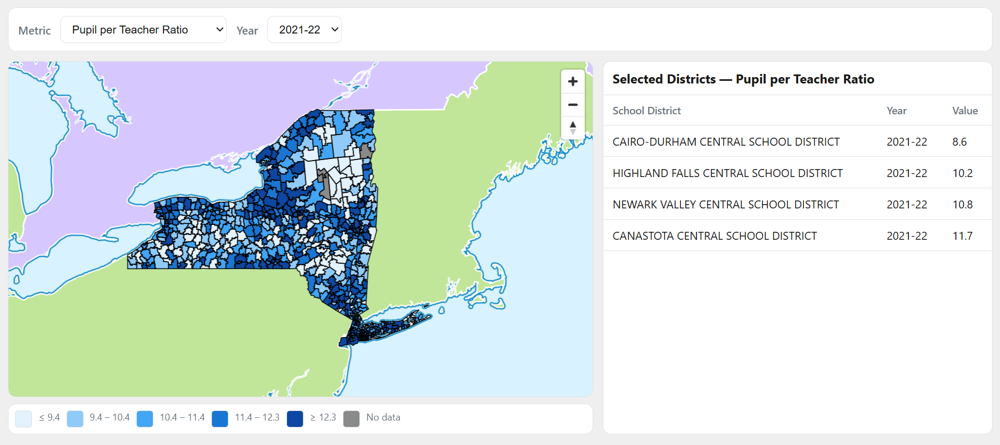

# Investigating Key Metrics of New York State School Districts

Alexandrea Harriott

## Description

This project is an interactive dashboard designed to explore how educational resources and outcomes vary across New York State school districts. By focusing on four key metrics—**graduation rate**, **total revenue per pupil**, **total expenditure per pupil**, and **pupil‑to‑teacher ratio**—the tool highlights disparities in funding, staffing, and student success.

Users can:
- **View statewide patterns** to understand broad trends.
- **Zoom into individual districts** for localized comparisons.
- **Hover over districts** to reveal detailed values.
- **Track changes over time** through a dynamic line chart.

The goal of this project is to make complex data accessible and engaging, helping educators, policymakers, and community members uncover how resources and outcomes differ across communities and evolve year by year.

## Data Sources

1. National Center for Education Statistic (NCES) Table Generator: https://nces.ed.gov/ccd/elsi/tableGenerator.aspx 
2. New York State Education Department (NYSED) : https://data.nysed.gov/downloads.php
3. New York State School District Shapefiles: https://data.gis.ny.gov/datasets/sharegisny::school-districts/explore
