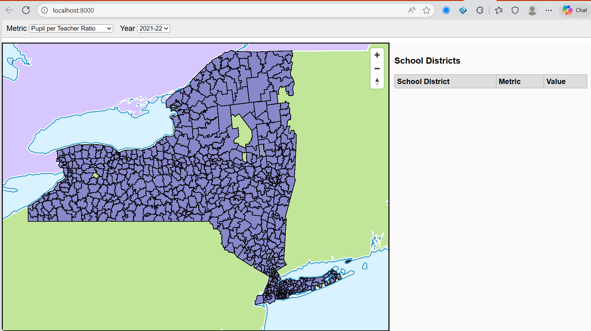
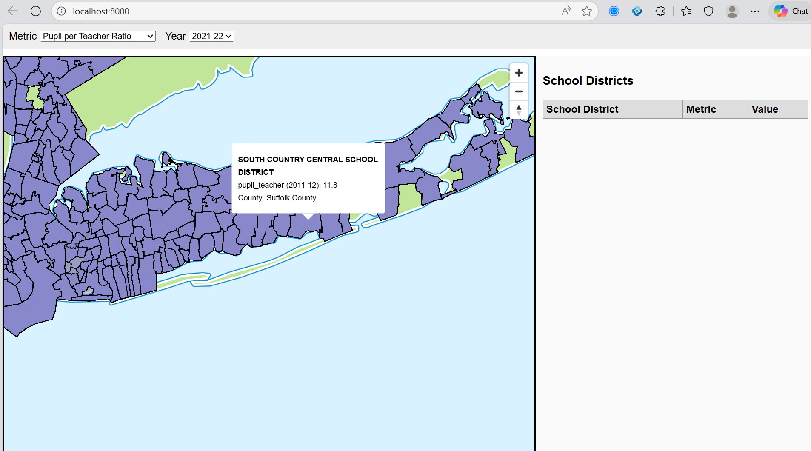
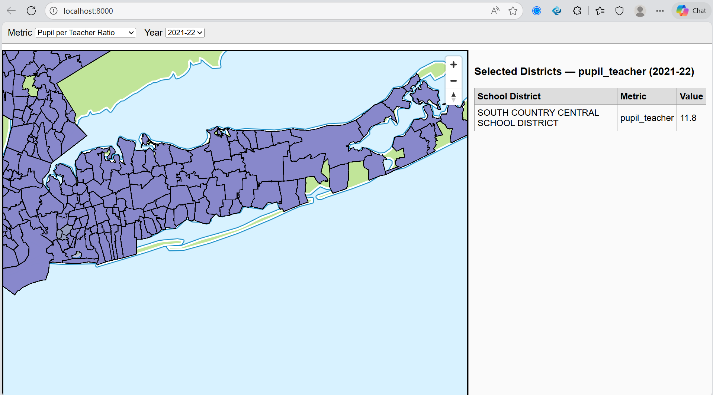
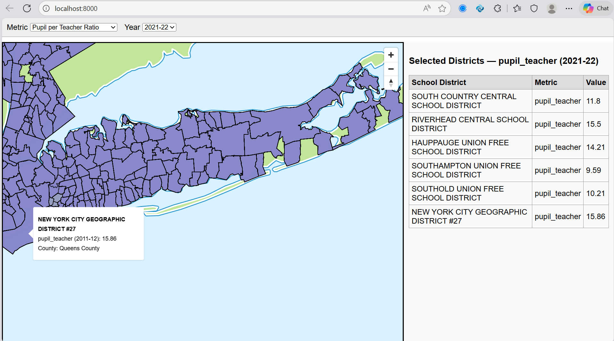

# Investigating Key Features of New York State School Districts

Alexandrea Harriott

## Goal
My goal is still to highlight the detailed data I have more fully, allowing users to pinpoint a metric and compare it across school districts. Compared to my first proposal, I am going to have less functionality and fewer interactives, and instead of Option A/B, I am currently looking at Option C.

## Data Challenges
Currently I do not have any challenges with the data, I just have to make sure everything is in the format I want, e,g. percentages having percent signs, etc.

## Walk Through

1. Open the webpage and choose a metric and year of interest at the top.

2. Use your mouse to hover over the different school districts.

3. If a school district interests you, click on it to add it to the table on the right.

4. Continue to explore and click on as many other school districts of interest to compare different school districts in the table.

## Questions

1. I'm not sure if my table as is fulfills the requirement for Option C; what do you think? I actually do want to create a better visualization for the requirment of at least one JS visualization.
