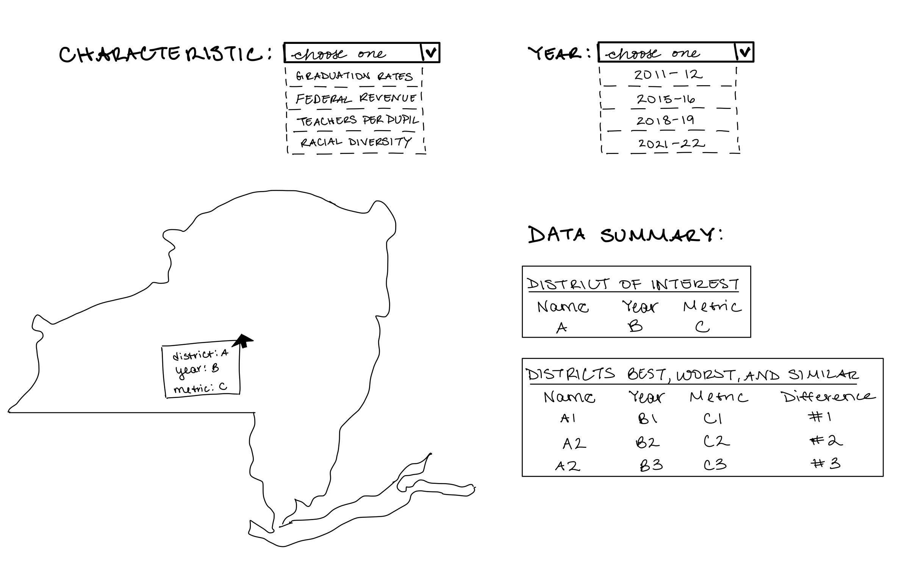
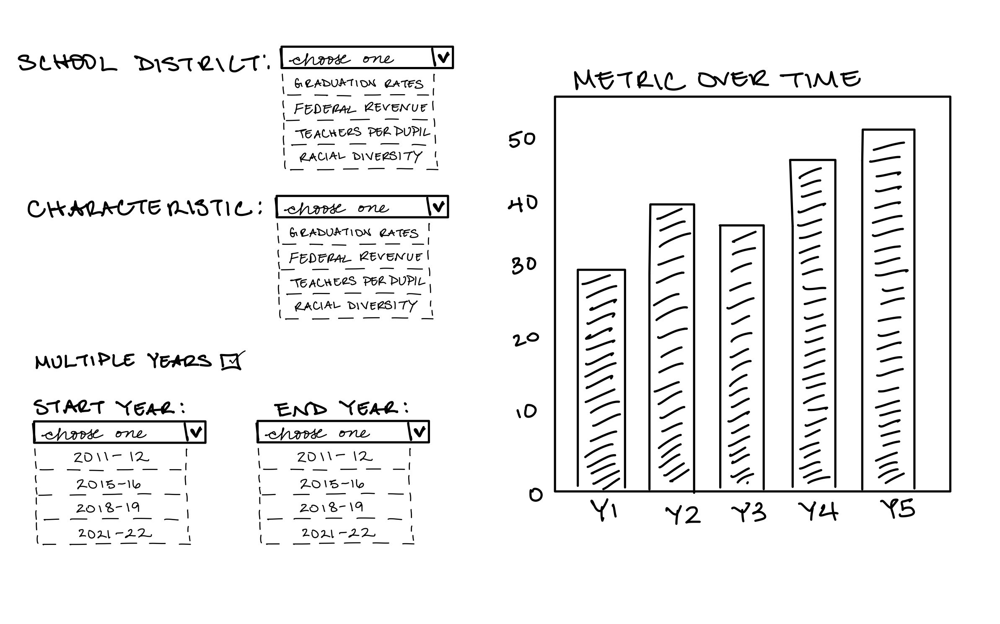

# Alexandrea Harriott

## Description

My prior static visualization project focused on characteristics of New York State School Districts, and I want to expand that project to really showcase the many characteristics and outcomes that are present across school districts and within school districts. In this interactive project, I will be able to utilize and highlight the detailed data more fully because users will be able to look at New York State as a whole, or pinpoint a specific locale, region, or even singular school district to uncover interesting characteristics like local, state, and federal revenue, racial composition, and graduaton rates over time.

## Technical Plan re: Option A/B/C/D

I am attempting option B: I want a map that showcases all the school districts in New York State, I also want a dahboard that allows for people to search by a region, locale, or school district, and obtain information about them (as well as provide comparisons to other entities at the level of choice), and possibly a dynamic chart that highlights how certain charactristics have changed over time. I think this option allows for an broad overview of what school districts look like now, but also for a targeted look into the data as well.

I would like to use Folium or MapLibre GL for mapping, and Plotly or Altiar for charts and tables.

Pieces I plan to draw inspiration from:
- For the entire project--dashboard, map, and chart--I would want something like this: https://www.kff.org/state-health-policy-data/state-indicator/health-care-expenditures-by-state-of-residence-in-millions/?activeTab=map&currentTimeframe=0&selectedDistributions=total-health-spending&sortModel=%7B%22colId%22:%22Location%22,%22sort%22:%22asc%22%7D
- For another map concept, I would want something like this that includes more detail when you hover over a place: https://www.nypad.org/InteractiveMap

## Mockup

## Data Sources

1. National Center for Education Statistic (NCES) Table Generator: https://nces.ed.gov/ccd/elsi/tableGenerator.aspx 
2. New York State Education Department (NYSED) : https://data.nysed.gov/downloads.php
3. New York State School District Shapefiles: https://data.gis.ny.gov/datasets/sharegisny::school-districts/explore

### Data Source 1: Self-Compiled Data

URL: https://github.com/a-harriott/uchicago-capp30239-static/blob/main/data/final_data.csv

Size: 12607 rows, 49 columns

This is data I compiled and cleaned from the data sources above, and it includes financial data, demographic information, staffing, and graduation rate data for all New York State school districts from academic year 2011-12 to academic year 2021-2022.

## Questions

1. I am still thinking about whether option A or B is best suited for what I want to do. I have data for many characteristics across 10 years, and I essentially just want people to be able to access that data. That sounds like option A, but I find that hard to envision. 
2. What's the best way to find libraries to use?
